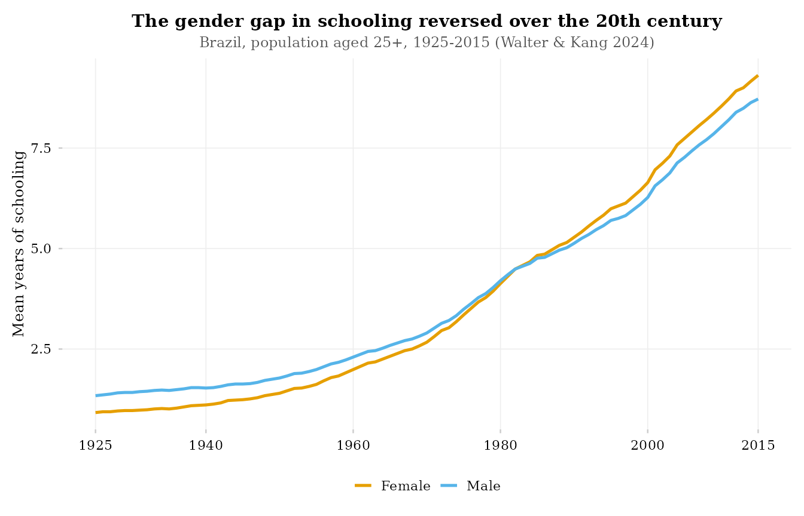
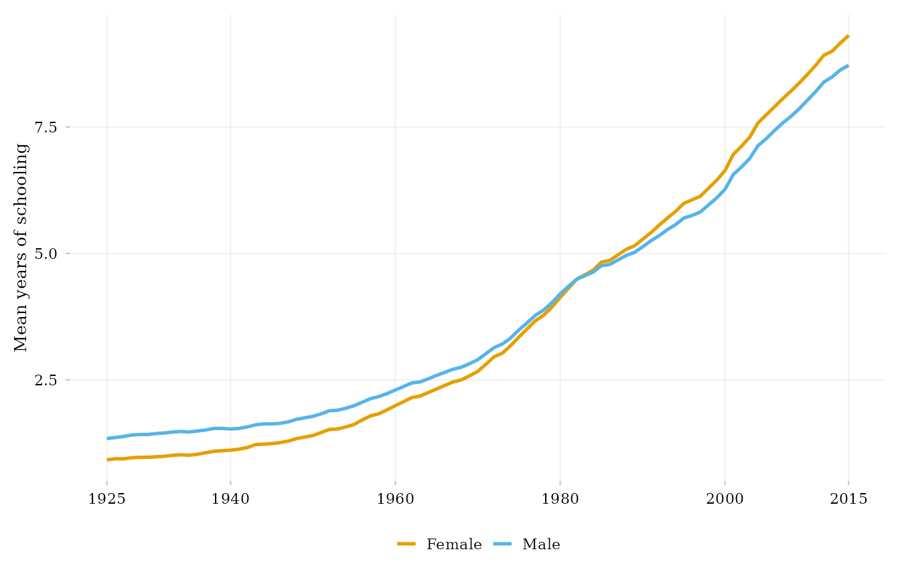
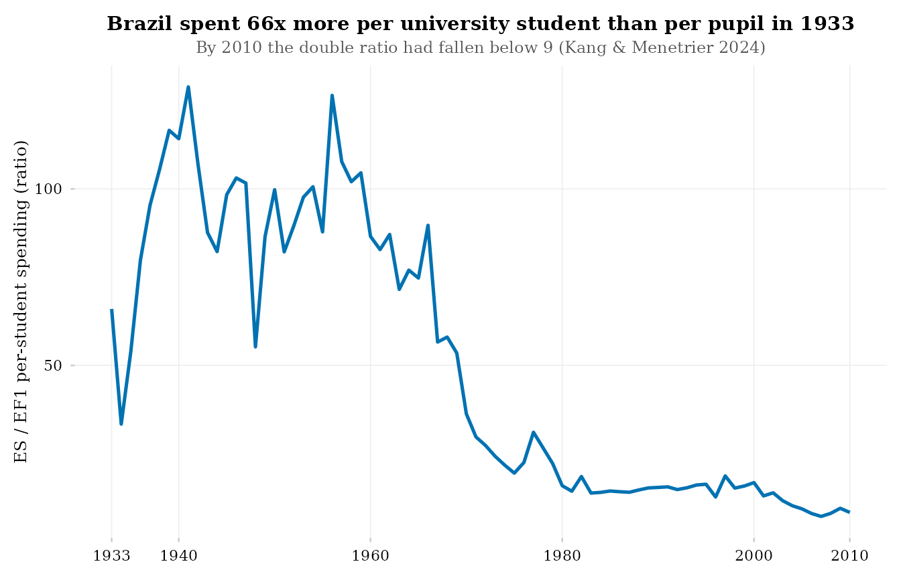

# The educabr2 visualization system

``` r

library(educabr2)
library(ggplot2)
```

`educabr2` ships a small, opinionated plotting toolkit so that a query
becomes a publication-ready figure in a few lines. The design follows
the principles of Kieran Healy’s *Data Visualization: A Practical
Introduction*: build on a clean minimal theme, use a colorblind-safe
palette, label honestly, and let the data — not the chrome — carry the
story.

## The three components

1.  **[`theme_educabr()`](https://mancano-tales.github.io/educabr2/reference/theme_educabr.md)**
    — a serif theme built on
    [`ggplot2::theme_minimal()`](https://ggplot2.tidyverse.org/reference/ggtheme.html),
    with quiet grid lines, a bottom legend and tuned text sizes. If a
    local TinyTeX installation is found (and the `showtext`/`sysfonts`
    packages are installed), the LaTeX font **Latin Modern Roman** is
    registered automatically, so your plots match LaTeX documents
    typographically; otherwise the theme falls back silently to the
    system serif font.
2.  **[`scale_colour_educabr()`](https://mancano-tales.github.io/educabr2/reference/scale_educabr.md)
    /
    [`scale_fill_educabr()`](https://mancano-tales.github.io/educabr2/reference/scale_educabr.md)**
    — discrete scales mapping to the **Okabe-Ito** palette, safe for the
    three common forms of color-vision deficiency.
3.  **`scale_x_year_educabr(years)`** — a year axis designed for the
    century-long series that are the norm in this package. Default
    `ggplot2` breaks assume short spans and become unreadable over a
    century; this scale picks the break spacing from the span of the
    data you actually plot (every 20 years beyond six decades, every 10
    years for spans of 25–60 years,
    [`pretty()`](https://rdrr.io/r/base/pretty.html) breaks below that),
    always labels the first and last year present in the series, and
    drops any grid break that would collide with those extreme labels.

## A first figure

``` r

df <- get_schooling(geo_level = "BR", dimension = "sex")

ggplot(df, aes(year, value, colour = dim_sex)) +
  geom_line(linewidth = 0.9) +
  scale_colour_educabr(name = NULL, labels = tools::toTitleCase) +
  scale_x_year_educabr(df$year) +
  theme_educabr() +
  labs(
    x = NULL, y = "Mean years of schooling",
    title    = "The gender gap in schooling reversed over the 20th century",
    subtitle = "Brazil, population aged 25+, 1925-2015 (Walter & Kang 2024)"
  )
```



## Titles inside or outside the figure: `plot_titles`

For slides, blog posts and dashboards you usually want the title
*inside* the image (the default above). For LaTeX/Quarto manuscripts the
caption and source note live in the *document*, and a title baked into
the image would duplicate them. `theme_educabr(plot_titles = FALSE)`
strips in-canvas titles, subtitles and captions:

``` r

ggplot(df, aes(year, value, colour = dim_sex)) +
  geom_line(linewidth = 0.9) +
  scale_colour_educabr(name = NULL, labels = tools::toTitleCase) +
  scale_x_year_educabr(df$year) +
  theme_educabr(plot_titles = FALSE) +
  labs(x = NULL, y = "Mean years of schooling")
```



This is exactly how the figures of the `educabr2` paper/appendix are
produced: clean canvases, with captions and notes written in the
manuscript.

## A century-long, multi-series example

``` r

ratio <- get_expenditure(indicator = "double_ratio_es_ef1")

ggplot(ratio, aes(year, value)) +
  geom_line(colour = "#0072B2", linewidth = 0.9) +
  scale_x_year_educabr(ratio$year) +
  theme_educabr() +
  labs(
    x = NULL, y = "ES / EF1 per-student spending (ratio)",
    title    = "Brazil spent 66x more per university student than per pupil in 1933",
    subtitle = "By 2010 the double ratio had fallen below 9 (Kang & Menetrier 2024)"
  )
```



Note the axis: on a 1933–2010 span,
[`scale_x_year_educabr()`](https://mancano-tales.github.io/educabr2/reference/scale_x_year_educabr.md)
places decadal-style breaks and labels both endpoints — no crowding, no
unlabeled extremes.

## Palette reference

The Okabe-Ito palette used by
[`scale_colour_educabr()`](https://mancano-tales.github.io/educabr2/reference/scale_educabr.md)
/
[`scale_fill_educabr()`](https://mancano-tales.github.io/educabr2/reference/scale_educabr.md),
in order:

|  \# | Hex       | Name           |
|----:|:----------|:---------------|
|   1 | `#E69F00` | orange         |
|   2 | `#56B4E9` | sky blue       |
|   3 | `#009E73` | bluish green   |
|   4 | `#0072B2` | blue           |
|   5 | `#D55E00` | vermillion     |
|   6 | `#CC79A7` | reddish purple |
|   7 | `#F0E442` | yellow         |
|   8 | `#000000` | black          |

Beyond 8 categories the scales will error — by design. A line chart with
more than eight simultaneously coloured series is rarely readable;
prefer faceting, or highlight a few series against a grey background.
